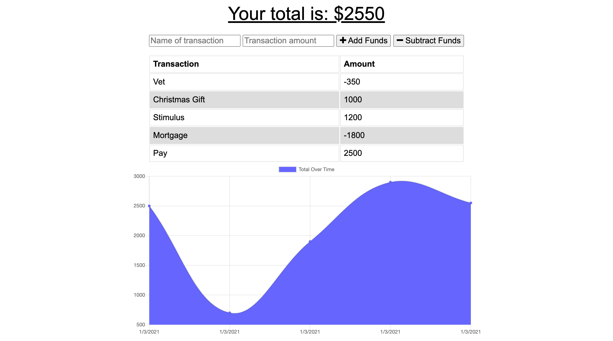
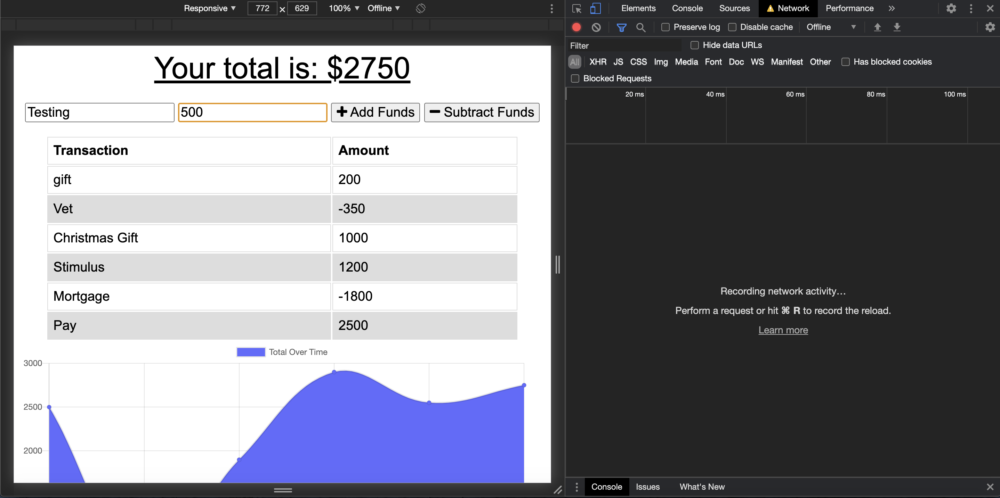
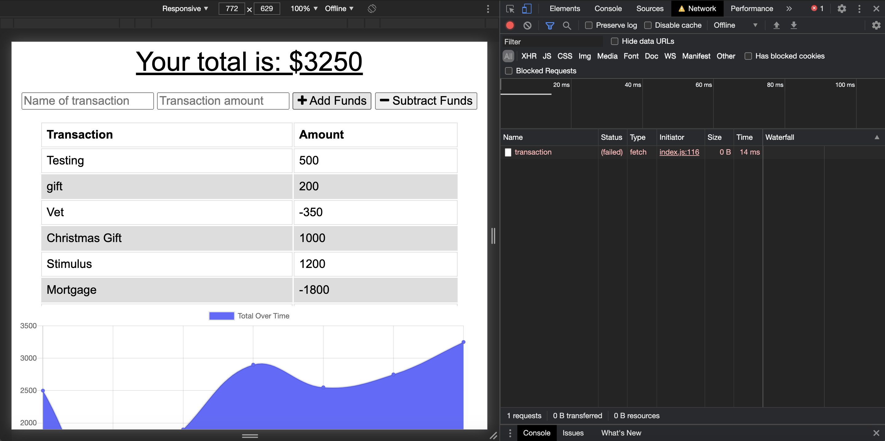
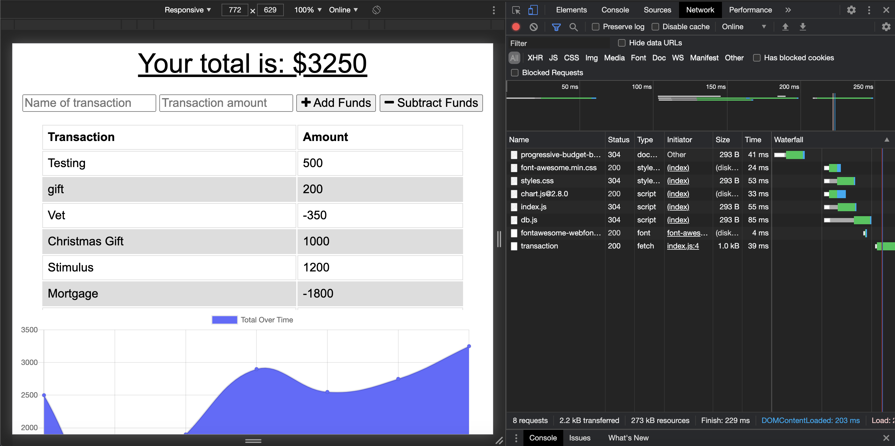

# Progressive Budget

## Description 
This MongoDB based application will allow users to add expenses and deposits to their budget with or without an internet connection.

When offline the users can enter deposits and expenses. When brought back online the users offline tracking will be added to the tracker. This offline functionality will allow the user access to their financial information anytime, anywhere. 

## Table of Contents  
* [Usage](#usage)
* [License](#license)
* [Contributing](#contributing)
* [Questions](#questions)
* [Links](#links)

## Usage 
To use the application, type in the name for your transaction and the amount of the transaction. Then press either the "Add Funds" or "Subtract Funds" button to add or subtract the amount of your transaction from your budget and to see the graph change with your newly entered data.

When offline, continue to use the application as normal, your data will be stored locally and you can still see your entered data reflected in the application.

When you go back online your entered transaction will be saved in the database.

## License
This project is licensed under the MIT license.

## Contributing
To contribute to this project you can fork this GitHub repository.

## Questions
If you have any additional questions about this application you can reach out to me at briannahebeler@gmail.com.
You can check out some of my other projects at briannahebeler (https://github.com/briannahebeler).

## Links
* The URL to the deployed application: https://progressive-budget-briheb.herokuapp.com/
* The URL to the GitHub repository: https://github.com/briannahebeler/progressive-budget